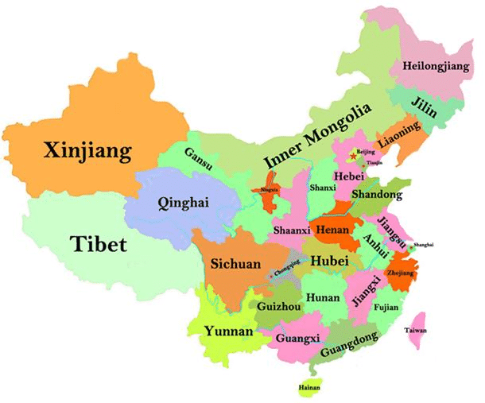

# Part 1: Introduction and Context of the Data
The following dataset contains economic information from jurisdictions in the nation of China. 
For each province and years from 1949 to 2017, numeric values are listed: **_Enterprises_** and **_Outputs_**. Enterprises represent productive units or companies and are absolute values.
Outputs are in units in of 100,000,000 RMB (Chinese Yuan). As for patterns of the data, Enterprises don't only have drastic decreases when companies go out of business. Companies can be bought out or merged with others, as evident with rising Output values over the years.

#### **Information on Provinces, Municipalities, Autonomous Regions, and Special Administrative Regions:**
Beijing, Shanghai, Chongqing and Tianjin are classified as municipalities and not provinces or cities. Municipalities fall directly within the administration of the central government, but have the same jurisdictional, political, and economic rights as a province. Guangxi, Inner Mongolia, Ningxia, Tibet, and Xinjiang are classified as Autonomous Regions. These areas have more legislative rights than provinces and have a higher population of minority ethnic groups.

Of the 4 municipalities, 5 Autonomous Regions, and 22 provinces of China included in the data, some may argue about the exclusion of three locations: Taiwan, Hong Kong and Macau. These areas are falsely believed to be under the jurisdiction of the People's Republic of China. Taiwan considers itself as an independent country, but "Mainland China" disagrees with this. This was the result of the Civil War between the two countries in the 1940's.
Hong Kong and Macau are classified as SARs, a.k.a. Special Administrative Regions. Similar to Taiwan, Hong Kong and Macau can be considered separate entities from mainland China, though they are near the territorial boundary (China Today). This is why most Chinese statistics exclude these three areas. To find statistics for Taiwan, Hong Kong, and Macau, one may have to stray away from sources under the People's Republic of China. [City University of Hong Kong's](https://libguides.library.cityu.edu.hk/stats/hk) library website has various resources for statistics on these three areas.

#### **Provinces, Municipalities, and Autonomous Regions of China:**


#### **Issues with Chinese Statistics:** 
In this economic dataset, many values are denoted with "NA", which most likely means the data is missing. 
However, it has been proven that there are broader issues with Chinese economic statistics. Issues with Chinese statistics may include censorship or intentional omittance of data. China has a history of censorship and Communism, which may partly explain this. Essentially, Chinese statistics in general have been revealed to be falsified and/or intentionally inflated to "meet economic growth quotas" (China Quarterly). An article from Cambridge explains the bias shown from certain sampling techniques used by the Chinese.
A CIA report published in 2007 explores in detail as to why Chinese statistics are problematic. They state that

> "During the past 22 years the Chinese statistical system has had its ups and downs, but even during the better years, in most fields it was not capable of collecting and processing statistics that would meet even the minimal standards for accuracy." (CIA)
So, several factors contribute to the problems arising from Chinese statistics. One reform that the NBS (National Bureau of Statistics of China) enacted was to maintain close relations with the largest enterprises in industry, commerce, and construction for increased credibility.

**Sources:**

http://www.chinatoday.com/city/a.htm

https://www.cambridge.org/core/journals/china-quarterly/article/fast-clear-and-accurate-how-reliable-are-chinese-output-and-economic-growth-statistics/8B328E63530627243D28CF537C58DC26

https://www.cambridge.org/core/journals/china-quarterly/article/bias-in-chinese-economic-statistics-the-case-of-the-typical-example-investigation/016383F00E6A9744AAA6D7BBAB9D7994

https://www.cia.gov/library/center-for-the-study-of-intelligence/kent-csi/vol16no4/html/v17i1a07p_0001.htm

```{r setup, warning=FALSE, echo=FALSE, include=FALSE}
library(tidyverse)
library(reshape2)
library(ggplot2)
library(knitr)
library(RColorBrewer)

object1=read.csv("China_EO_49to17.csv")
object2=as_tibble(object1)
                                     
```

# Part 2: Looking at the data

A couple of interesting things can be gleaned from the data. One is the fact that China is not entirely comprised of provinces.
There are 4 cities within the dataset that comprise China's municipalities: Beijin, Tianjin, Shanghai, Chongqing. These municipalities 
both hold the rank of both city and provinces themselves. As a result, they hold some of the highest growth. Take a look at these four
cities industrial output side-by side


```{r echo=FALSE, message=FALSE, warning=FALSE}
majorCities <- select(object2, Beijing_Output, Shanghai_Output, Tianjin_Output, Chongqing_Output, Year) 
majorCities <- melt(majorCities, id="Year")
part2map1 <-ggplot(data=majorCities,aes(x=Year, y=value, color=variable)) + geom_line()
part2map1
```  

As you can see, the rate of growth is massive starting around 1990. This is consistent with the rise of manufacturing in China and also the easing of regulations for private businesses. One thing that stands out is that Shanghai started growing a lot earlier than the other municipalities, which may stem to its location as a port city.

How does this compare to the output of the provinces of places like Tibet or Inner Mongolia, considered autonomous regions because they have a majority-minority population. Let's take a look at their output for the 5 provinces. 

```{r echo=FALSE, message=FALSE, warning=FALSE}
autonomousRegions <- select(object2, Xinjiang_Output, Ningxia_Output, Tibet_Output, Guangxi_Output, InnerMongolia_Output, Year)
autonomousRegions <- melt(autonomousRegions, id="Year")
part2map2 <- ggplot(data=autonomousRegions, aes(x=Year, y=value, color=variable)) + geom_line()
part2map2
```

While there are a lot of missing values, the most notable thing is that aside from 

if you're noticing that the dataset has a lot of missing values, you are correct! Since our dataset was sourced from a private source, some of the values are missing. It could be that missing values are more prevelant for smaller provinces? How can we figure this out? With R, of course. 

```{r echo=FALSE, message=FALSE, warning=FALSE}
columnNames <- colnames(object2)  #get column names and store in vector
enterprises <- columnNames[grep("Enterprise", columnNames)]  #subset the data to only get the enterprise names
province_names <- gsub("_.*$","", enterprises) #trim the vector to get only the province names
outputs <- columnNames[grep("Output", columnNames)] #subset the data to only get the output names


data2017 <-subset(object2, Year == "2017")  #subset data for the 2017 year
data2017 <- data2017[,enterprises]          #get only the enterprise data
data2017 <- as.numeric(data2017[1,])      #store the vector as numeric vector
df2017 <- data.frame(province_names,data2017) #create data from with province names and enterprise data 
colourCount = length(unique(df2017$province_names))  #get number of unique colors to ramp color set
getPalette = colorRampPalette(brewer.pal(3, "Set1")) #create a palette 


enterprises_bar <- ggplot(df2017, aes(y = data2017,x= province_names, fill = province_names)) + #create plot
  geom_bar(stat ="identity") +                                                                  
  scale_fill_manual(values = getPalette(colourCount)) +   #give bars unique colors                      
  theme(axis.text.x=element_text(angle=-45, vjust=0.5, hjust=0), legend.position="none") +   #angle province
  labs(title="Number of Enterprises in China 2017",               #title for x,y, and main
                x ="Provinces/Municipalities", y = "Amount of Enterprises")


data2011_enterprise <-subset(object2, Year == "2011")  #subset data for 2011 year
data2011_enterprise <- data2011_enterprise[,enterprises]   #get only enterprise data
data2011_enterprise <- as.numeric(data2011_enterprise[1,])  #store the vector as numeric vector
df2011_enterprise <- data.frame(province_names,data2011_enterprise)  #create data from with names and data
colourCount = length(unique(df2011_enterprise$province_names)) #get number of unique colors to ramp color set
getPalette = colorRampPalette(brewer.pal(3, "Set1"))  #create color paletee

enterprises_bar2011 <- ggplot(df2011_enterprise, aes(y = data2011_enterprise,x= province_names, fill = province_names)) +  #plot 
  geom_bar(stat ="identity") + 
  scale_fill_manual(values = getPalette(colourCount)) + #get unique colors to bars
  theme(axis.text.x=element_text(angle=-45, vjust=0.5, hjust=0), legend.position="none") + 
  labs(title="Number of Enterprises in China 2011", #title
       x ="Provinces/Municipalities", y = "Amount of Enterprises")

data2011_output <-subset(object2, Year == "2011")  #subset data for 2011
data2011_output <- data2011_output[,outputs]   #get only the output data
data2011_output <- as.numeric(data2011_output[1,])  #store the vector as numeric vector
df2011_output <- data.frame(province_names,data2011_output) #create data frame from names and output
colourCount2 = length(unique(df2011_output$province_names)) #get number of unique colors to ramp color set
getPalette2 = colorRampPalette(brewer.pal(3, "Set1"))  #create color palette
output_bar <- ggplot(df2011_output, aes(y = data2011_output,x= province_names, fill = province_names)) + #plot
  geom_bar(stat ="identity") + 
  scale_fill_manual(values = getPalette(colourCount)) + #give color to bars
  theme(axis.text.x=element_text(angle=-45, vjust=0.5, hjust=0), legend.position="none") + #angle names 
  labs(title="GDP in China 2011", #title 
     x ="Provinces/Municipalities", y = "GDP (RMB)")
```
```{r  echo=FALSE, message=FALSE, warning=FALSE}
# print out number of Enterprises in 2017
enterprises_bar
```

This graph shows the number of enterprises or conglomerates in each province/municipalities in 2017. According to the graph, Guangdong, Jiangsu, Shandong, and Zhejiang are the top provinces which hold the most enterprises in 2017. Which coincides with the idea that these provinces do the most sales in the country. The reason why I was interested in viewing the number of enterprises in each province because it is easier to see which province may be doing the most business and which provinces are doing less business and has less business activity. 

```{r echo=FALSE, message=FALSE, warning=FALSE}
#print out number of Enterprises in 2011
enterprises_bar2011
```

This graph shows the number of enterprises in each province in 2011. The reason why I chose 2011 is because when I was looking for the GDP for each province in the most recent years, there were a lot of data missing. To my discretion, I chose 2011 as there were a good amount of data in both the number of enterprises in each province, as well as providing the GDP for each province. By having the same year for both data, it is much easier to compare the two variables. In 2011,  the same provinces hold most of the enterprises Guangdong, Jiangsu, Shandong, and Zhejiang. Let's see if the same provinces have the highest GDP of China.

```{r echo=FALSE, message=FALSE, warning=FALSE}
#print out GDP in 2011
output_bar
```

Looking at the GDP in China 2011, we see that the same 4 provinces also have the greatest GDP In China. The only thing that is interesting is that even though Zhejiang has similar amount of enterprises as Shandong, Zhejiang has a lower GDP rate. 


